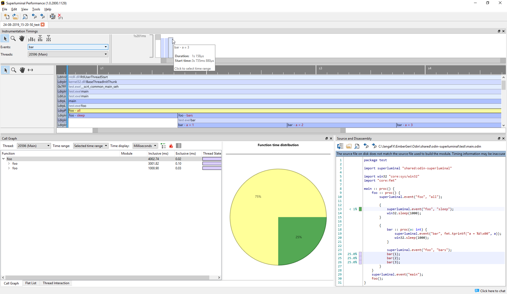

# odin-superluminal

Odin bindings and wrapper for [Superluminal Performance](https://www.superluminal.eu/). This is achieved by making a thin C wrapper that around PerformanceAPI that is callable from Odin. Only the `BeginEvent` and `EndEvent` part of the API is available.

The procedure `superluminal.event` an overload of the `superluminal.event_id` and `superluminal.event_id_and_data` procedures, which takes 

## API

```go
package superluminal

foreign import superluminal { "lib/superluminal.lib" };

foreign superluminal {
    begin_event :: proc(inID: cstring) ---;
    begin_event_data :: proc(inID, inData: cstring) ---;
    end_event :: proc() ---;
}

@(deferred_none=end_event)
event_id :: proc(inID: string) {
    begin_event(cast(cstring)&inID[0]);
}

@(deferred_none=end_event)
event_id_and_data :: proc(inID, inData: string) {
    begin_event_data(cast(cstring)&inID[0], cast(cstring)&inData[0]);
}

event :: proc{event_id, event_id_and_data};
```

Note that both overloads in the `event` procedure implicitly defer a call to  `end_event` at the end of the *callee's* scope. 

**Warning: This assume that all passed strings are zero-terminated. This is the case for string constants and literals, but not necessarily in heap-allocated strings.** 

## Example

The following is compiled with `odin build . -debug`:

```go
package test 

import superluminal "shared:odin-superluminal"

import win32 "core:sys/win32"
import "core:fmt"

main :: proc() {
    foo :: proc() {
        superluminal.event("foo", "all");
        
        {
            superluminal.event("foo", "sleep");
            win32.sleep(1000);
        }
        
        {
            bar :: proc(a: int) {
                superluminal.event("bar", fmt.tprintf("a = %d\x00", a));
                win32.sleep(1000);
            }

            superluminal.event("foo", "bars");
            bar(1);
            bar(2);
            bar(3);
        }
    }
    superluminal.event("main");
    foo();
}
```

